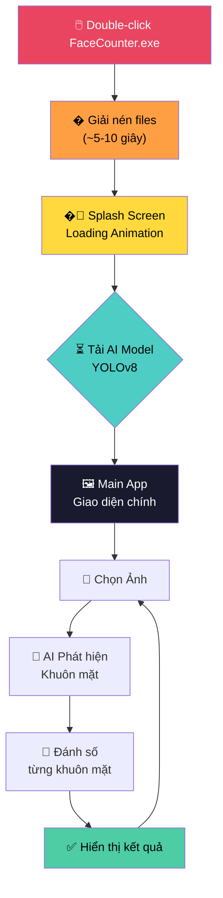

# 🔍 Tool Đếm Khuôn Mặt Trong Ảnh

Ứng dụng GUI sử dụng AI (YOLOv8) để phát hiện và đếm số khuôn mặt trong ảnh.


## 🔄 Sơ đồ hoạt động



> ⚠️ **Lưu ý**: Bước "Giải nén files" là do PyInstaller `--onefile` mode cần giải nén ~343MB vào thư mục tạm trước khi chạy. Lần chạy sau sẽ nhanh hơn nếu files đã được cache.

## ✨ Tính năng

- 📷 Hỗ trợ: JPG, PNG, BMP, GIF, WebP
- 🤖 AI YOLOv8 phát hiện khuôn mặt
- 🔢 Đánh số thứ tự cho mỗi khuôn mặt
- 🎨 Giao diện Dark theme đẹp mắt
- 🔄 Splash screen loading animation
- ⚡ Hỗ trợ CPU và GPU

## 🚀 Sử dụng

### Cách 1: Chạy file EXE (Khuyên dùng)
```
Double-click file: dist/FaceCounter.exe
```

### Cách 2: Chạy từ Python
```bash
pip install -r requirements.txt
python main.py
```

## 📖 Hướng dẫn

1. Double-click `FaceCounter.exe`
2. Đợi splash screen loading
3. Click **"Chọn Ảnh"**
4. Xem kết quả với số thứ tự trên mỗi khuôn mặt

## 🛠️ Cấu trúc

```
tool-find-human/
├── main.py              # Entry point + Splash screen
├── app.py               # GUI Tkinter
├── person_detector.py   # Face detection
├── splash_screen.py     # Splash screen module
├── requirements.txt     # Dependencies
├── dist/
│   └── FaceCounter.exe  # Standalone EXE
└── README.md
```

## 📝 Ghi chú

- Lần đầu chạy sẽ download model YOLOv8 (~6MB)
- EXE có dung lượng ~343MB (bao gồm Python + AI)

## 📄 License

MIT License

